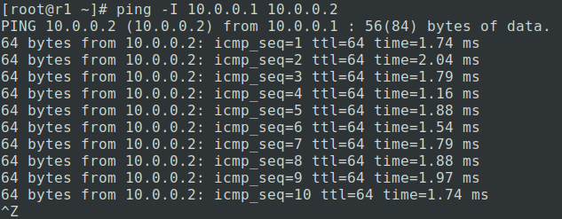
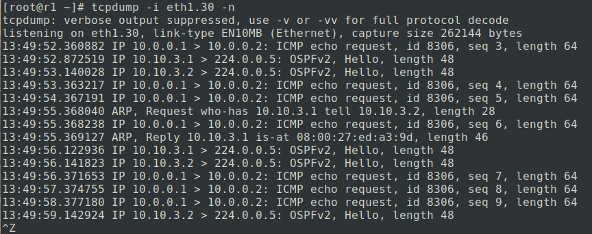
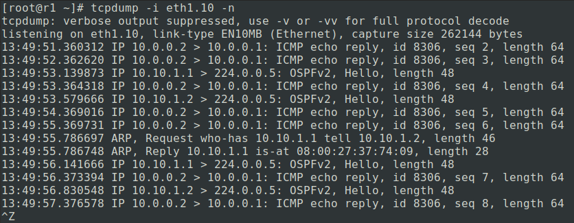
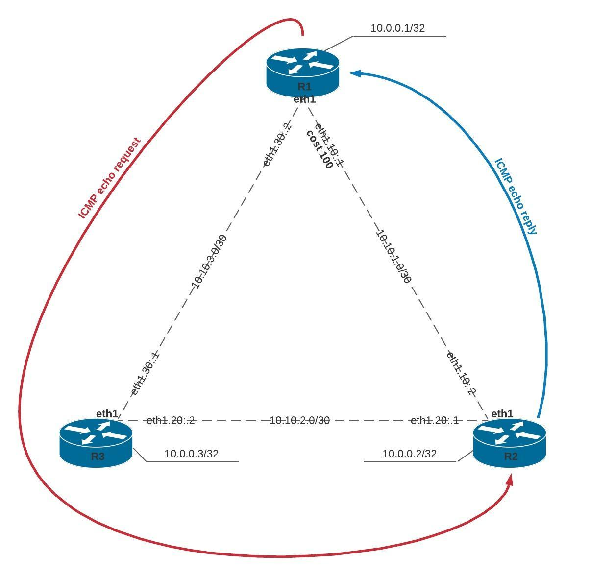
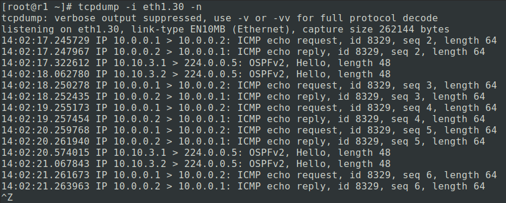

## Стенд для статической и динамической маршрутизации, OSPF.

Цель: OSPF
- Поднять три виртуалки
- Объединить их разными vlan
1. Поднять OSPF между машинами на базе Quagga
2. Изобразить ассиметричный роутинг
3. Сделать один из линков "дорогим", но что бы при этом роутинг был симметричным


### Реализация.

#### 1. Поднимим OSPF между машинами на базе Quagga

Устаноим пакеты для OSPF на всех роутерах.
```
[root@r1 ~]# yum install -y quagga
[root@r1 ~]# yum install -y tcpdump
```

Настроим передачу пакетов меду интерфейсами.
```
[root@r1 ~]# echo "net.ipv4.ip_forward = 1" > /etc/sysctl.d/ip_forwarding.conf
[root@r1 ~]# echo "net.ipv4.conf.all.rp_filter = 2" >> /etc/sysctl.d/ip_forwarding.conf
[root@r1 ~]# sysctl -p
```
Аналогично на `r2` и `r3`.

Настроим loopback-интерфейс.
```
[root@r1 ~]# vi /etc/sysconfig/network-scripts/ifcfg-lo.2
```
```
DEVICE=lo:2
IPADDR=10.0.0.1
NETMASK=255.255.255.255
NETWORK=10.0.0.0
ONBOOT=yes
NAME=loopback-2
```
Аналогично на `r2 (IPADDR=10.0.0.2)` и `r3 (IPADDR=10.0.0.3)`.

Настройка сетевого интерфейса на `r2` и `r3`.
```
[root@r2 ~]# echo DEFROUTE="no" >> /etc/sysconfig/network-scripts/ifcfg-eth0 && systemctl restart network
[root@r3 ~]# echo DEFROUTE="no" >> /etc/sysconfig/network-scripts/ifcfg-eth0 && systemctl restart network
```
Отредактируем конфигурационные файлы `/etc/quagga/ospfd.conf` и `/etc/quagga/zebra.conf`.

<details>
  <summary>Роутер r1:</summary>

```
[root@r1 ~] vi /etc/quagga/ospfd.conf
! -*- ospf -*-
!
! OSPFd sample configuration file
!
!
!
log stdout
log file /var/log/quagga/ospfd.log
!
!
interface eth0
!
interface eth1
!
interface eth1.10
 ip ospf cost 10
 ip ospf hello-interval 3
 ip ospf dead-interval 10
!
interface eth1.30
 ip ospf cost 10
 ip ospf hello-interval 3
 ip ospf dead-interval 10
!
interface lo
!
router ospf
 ospf router-id 10.0.0.1
 network 10.0.0.1/32 area 1
 network 10.10.1.0/30 area 0
 network 10.10.3.0/30 area 0
 default-information originate
!
line vty
!
```

```
[root@r1 ~] vi /etc/quagga/zebra.conf
! -*- zebra -*-
!
! zebra sample configuration file
!
! $Id: zebra.conf.sample,v 1.1 2002/12/13 20:15:30 paul Exp $
!
hostname r1
!
interface eth0
 ipv6 nd suppress-ra
!
interface eth1
 ipv6 nd suppress-ra
!
interface lo
!
ip forwarding
!
log file /var/log/quagga/zebra.log
!
line vty
!
```
```
[root@r1 ~] systemctl restart ospfd.service zebra.service
```

</details>

<details>
  <summary>Роутер r2:</summary>

```
[root@r2 ~] vi /etc/quagga/ospfd.conf
! -*- ospf -*-
!
! OSPFd sample configuration file
!
!
!
log stdout
log file /var/log/quagga/ospfd.log
!
!
interface eth0
!
interface eth1
!
interface eth1.20
 ip ospf cost 10
 ip ospf hello-interval 3
 ip ospf dead-interval 10
!
interface eth1.10
 ip ospf cost 10
 ip ospf hello-interval 3
 ip ospf dead-interval 10
!
interface lo
!
router ospf
 ospf router-id 10.0.0.2
 network 10.0.0.2/32 area 1
 network 10.10.2.0/30 area 0
 network 10.10.1.0/30 area 0
 default-information originate
!
line vty
!
```

```
[root@r2 ~] vi /etc/quagga/zebra.conf
! -*- zebra -*-
!
! zebra sample configuration file
!
! $Id: zebra.conf.sample,v 1.1 2002/12/13 20:15:30 paul Exp $
!
hostname r2
!
interface eth0
 ipv6 nd suppress-ra
!
interface eth1
 ipv6 nd suppress-ra
!
interface lo
!
ip forwarding
!
log file /var/log/quagga/zebra.log
!
line vty
!
```
```
[root@r2 ~] systemctl restart ospfd.service zebra.service
```
</details>


<details>
  <summary>Роутер r3:</summary>

```
[root@r3 ~] vi /etc/quagga/ospfd.conf
! -*- ospf -*-
!
! OSPFd sample configuration file
!
!
!
log stdout
log file /var/log/quagga/ospfd.log
!
!
interface eth0
!
interface eth1
!
interface eth1.30
 ip ospf cost 10
 ip ospf hello-interval 3
 ip ospf dead-interval 10
!
interface eth1.20
 ip ospf cost 10
 ip ospf hello-interval 3
 ip ospf dead-interval 10
!
interface lo
!
router ospf
 ospf router-id 10.0.0.3
 network 10.0.0.3/32 area 1
 network 10.10.3.0/30 area 0
 network 10.10.2.0/30 area 0
 default-information originate
!
line vty
!
```

```
[root@r3 ~] vi /etc/quagga/zebra.conf
! -*- zebra -*-
!
! zebra sample configuration file
!
! $Id: zebra.conf.sample,v 1.1 2002/12/13 20:15:30 paul Exp $
!
hostname r3
!
interface eth0
 ipv6 nd suppress-ra
!
interface eth1
 ipv6 nd suppress-ra
!
interface lo
!
ip forwarding
!
log file /var/log/quagga/zebra.log
!
line vty
!
```
```
[root@r3 ~] systemctl restart ospfd.service zebra.service
```
</details>

#### 2. Ассиметричный роутинг
Отредактируем конфигурационный файл `/etc/quagga/ospfd.conf`

```
[root@r2 ~] sed -i '21s/ ip ospf cost 10/ ip ospf cost 100/g' /etc/quagga/ospfd.conf
[root@r2 ~] systemctl restart ospfd.service zebra.service
```
Проверим

Откроем 3 терминала роутера `r1`.
1. На первом запустим команду `ping -I 10.0.0.1 10.0.0.2`

2. На втором запустим команду `tcpdump -i eth1.10 -n`

3. На третьем запустим команду `tcpdump -i eth1.30 -n`

Видим, что пакеты `ICMP echo request` уходят с интерфейса `eth1.30`, а `ICMP echo reply` приходят уже на интерфейс `eth1.10`.


#### 3. Сделаем один из линков "дорогим", но что бы при этом роутинг был симметричным

Отредактируем конфигурационный файл `/etc/quagga/ospfd.conf`

```
[root@r1 ~] sed -i '21s/ ip ospf cost 10/ ip ospf cost 100/g' /etc/quagga/ospfd.conf
[root@r1 ~] systemctl restart ospfd.service zebra.service
```
Проверим

Откроем 2 терминала роутера `r1`.
1. На первом запустим команду `ping -I 10.0.0.1 10.0.0.2`

2. На втором запустим команду `tcpdump -i eth1.30 -n`

Видим, что пакеты `ICMP echo request` уходят и `ICMP echo reply` приходят на интерфейса `eth1.30`, таким образом пакеты прошли через роутер `r3`.


#### Проверка задания

1. Выполнить `vagrant up`, автоматически настроиться и поднимиться OSPF между машинами на базе Quagga.
2. Для ассиметричного роутинга, выполнить плейбук команду `ansible-playbook asymmetric.yml`. Для наглядности открыть три окна с терминалом роутера `r1`, на первом терминале запусть команду `ping -I 10.0.0.1 10.0.0.2`, на втором и третьем терминале запустить команду `tcpdump -i eth1.10 -n` и `tcpdump -i eth1.30 -n`. Видим, что пакеты `ICMP echo request` уходят с интерфейса `eth1.30`, а `ICMP echo reply` приходят уже на интерфейс `eth1.10`.
3. Для ссиметричного роутинга, выполнить плейбук команду `ansible-playbook symmetric.yml`. Для наглядности открыть два окна с терминалом роутера `r1`, на первом терминале запусть команду `ping -I 10.0.0.1 10.0.0.2`, на втором `tcpdump -i eth1.30 -n`. Видим, что пакеты `ICMP echo request` уходят и `ICMP echo reply` приходят на интерфейса `eth1.30`, таким образом пакеты прошли через роутер `r3`.

Ссылка на дополнительную информацию
- [OSPF](https://easy-network.ru/51-urok-31.html)
